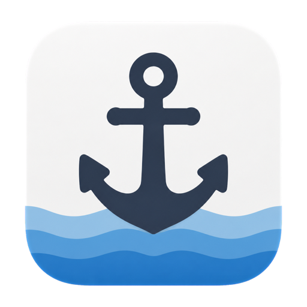
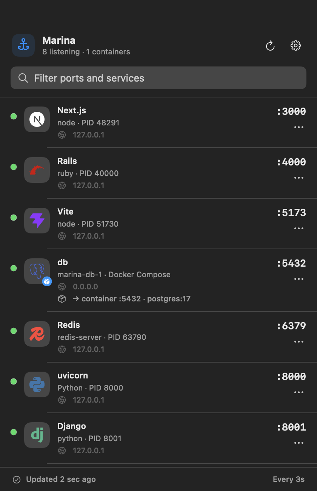

<p align="center">
  
</p>

<h1 align="center">Marina</h1>

<p align="center">
  English | <a href="README.ja.md">日本語</a>
</p>

Marina is a native macOS menu bar utility that shows local TCP listeners, their owning processes, inferred service types, and Docker/Compose port mappings in one compact panel.



The screenshot is rendered from the production SwiftUI view with deterministic fixture data. A [light-mode rendering](docs/marina-panel-light.png) is generated by the same test. The real panel uses the current Mac's `lsof` and Docker data.

## Requirements

- macOS 14 Sonoma or later
- Xcode 15 or later (verified with Xcode 26.3)
- Docker CLI and a running Docker daemon for container enrichment; normal port scanning works without Docker

## Download

Download the latest `Marina-macos-universal.zip` from [GitHub Releases](https://github.com/keishingu/Marina/releases/latest), extract it, and move `Marina.app` to the Applications folder. The Universal build supports both Apple Silicon and Intel Macs and includes the Marina app icon.

Release builds are signed with a Developer ID Application certificate and notarized by Apple. The notarization ticket is also stapled to `Marina.app`, so you can launch it from Finder like a regular macOS app.

Each push to `main` (including a merged pull request) builds the Release configuration and publishes a versioned GitHub Release automatically. A checksum is provided alongside the ZIP as `Marina-macos-universal.zip.sha256`.

## Build and test

Open `Marina.xcodeproj`, select the `Marina` scheme, then Run. Marina is an `LSUIElement` app, so it appears in the menu bar rather than the Dock.

Command-line build:

```sh
xcodebuild \
  -project Marina.xcodeproj \
  -scheme Marina \
  -configuration Debug \
  -destination 'platform=macOS' \
  build
```

Tests:

```sh
xcodebuild \
  -project Marina.xcodeproj \
  -scheme Marina \
  -configuration Debug \
  -destination 'platform=macOS' \
  test
```

## Architecture

```text
Marina/
├── App/                    MenuBarExtra, shared state, settings
├── Features/Ports/         List, row, detail, view model
├── Core/
│   ├── CommandRunner/      Process-based command boundary and actions
│   ├── DockerResolver/     Docker JSON parsing, availability, matching
│   ├── Models/             Listener, process, service, container models
│   ├── PortScanner/        lsof field parser and normalization
│   ├── ProcessResolver/    ps/lsof process metadata enrichment
│   ├── ServiceResolver/    Conservative service inference
│   └── TunnelResolver/     ngrok/Cloudflare origin matching
└── DesignSystem/           Service logos, SF Symbol fallbacks, status indicators
```

SwiftUI owns presentation only. External commands are behind `CommandRunning`; parsers and resolvers are value types and can be tested with fixture output. `PortListViewModel` runs the port and Docker scans concurrently, prevents overlapping refreshes, and retains the last successful Docker container data when a later Docker refresh fails.

## Port discovery

Marina runs `/usr/sbin/lsof` through `Foundation.Process` with explicit arguments:

```text
-nP -iTCP -sTCP:LISTEN -F0pcuLftnPT
```

`-F0` provides NUL-delimited fields instead of a display-oriented table. Marina parses process name, PID, user, endpoint, TCP state, and IPv4/IPv6 family, then enriches each unique PID with:

- `/bin/ps -p <pid> -o ppid= -o command=`
- `/usr/sbin/lsof -a -p <pid> -d txt -Fn`
- `/usr/sbin/lsof -a -p <pid> -d cwd -Fn`

IPv4 and IPv6 sockets belonging to the same PID, host port, and protocol are normalized into one listener while retaining all bind addresses and families. Results are sorted by ascending port.

## Tunnel integration

Marina recognizes common `ngrok http <port>` and `cloudflared tunnel --url <local URL>` commands. When the declared origin is an active local listener, the provider appears as a badge and dedicated menu on that origin service. ngrok's Inspector and cloudflared's metrics listeners are then folded into the origin instead of appearing as unrelated ports.

The tunnel menu links to the provider dashboard, copies the running command, and opens the local Traffic Inspector when ngrok exposes one. Named tunnels or missing origin listeners are not guessed; Marina keeps the management listener visible and shows a tunnel-specific warning.

## Docker integration

Marina locates the Docker CLI in the standard Homebrew, `/usr/local`, and Docker Desktop application paths. It uses:

1. `docker ps --format '{{json .}}'` to enumerate running container IDs.
2. One `docker inspect <id>…` call to decode authoritative container state, image, port bindings, and labels.

The inspect JSON provides host IP/port, container port, protocol, running status, and these Compose labels:

- `com.docker.compose.project`
- `com.docker.compose.service`
- `com.docker.compose.container-number`
- `com.docker.compose.project.working_dir`
- `com.docker.compose.project.config_files`

TCP host port and compatible bind IP are matched against each `ListeningPort`. A wildcard bind is compatible with a concrete Docker host IP. Multiple matching containers remain explicit candidates; Marina does not silently select one. A single match replaces `com.docker.backend`-style presentation with Compose/container information.

Docker Desktop is only required when Docker enrichment or container actions are used. A missing CLI, stopped daemon, permission error, or malformed JSON is shown as a Docker-specific warning while ordinary listeners remain visible.

## Service logos and third-party marks

Recognized services use monochrome or restrained brand-color SVG marks from Simple Icons 16.21.0. Unknown services continue to use an SF Symbol, and Docker state is shown by a separate shipping-box badge so a brand color is never the only status signal.

Simple Icons is distributed under CC0-1.0, but individual marks may remain subject to copyright, trademark, and their owners' usage terms. Marina uses them only to identify detected technologies and does not imply endorsement, affiliation, or sponsorship. See [THIRD_PARTY_NOTICES.md](THIRD_PARTY_NOTICES.md) and the bundled Simple Icons license and disclaimer under `Marina/Resources/Licenses`.

## App Sandbox and permissions

App Sandbox is disabled for the MVP. Reliable access to system process metadata, `/usr/sbin/lsof`, `/bin/ps`, the Docker CLI, and Docker Desktop's daemon endpoint is the product's core function, and those operations are restricted or impractical in a conventional sandboxed app.

Consequences:

- This build is intended for direct distribution and Developer ID notarization, not the Mac App Store in its current form.
- Marina never invokes `sudo`, interpolates user input into a shell, or logs the environment.
- Commands use fixed executable URLs and explicit argument arrays.
- PID and container ID identities are rechecked immediately before destructive operations.
- Process termination sends `SIGTERM` first; `SIGKILL` is a separate explicit action.
- Docker stop and restart are confirmed according to settings. `docker kill` is not exposed.
- Permission failures remain visible errors and are not replaced with fabricated data.

Future sandbox-compatible alternatives include a separately installed, signed helper with a narrow XPC contract, a privileged helper only if truly required, or a Docker Engine integration mediated by user-granted endpoints. Each option needs a dedicated threat model and distribution review.

## Current limitations

- Docker uses CLI JSON rather than the Docker Engine API.
- Display is one row per host port. Container grouping is modeled but its setting remains disabled until that view mode exists.
- IPv4/IPv6 duplicate normalization is mandatory; its setting is shown disabled to explain the behavior.
- Activity Monitor opens the application but cannot preselect the PID through a supported public API.
- Service identification is heuristic and intentionally falls back to a runtime or `Unknown` when evidence is weak.
- `lsof` can only return process metadata visible to the current user; Marina does not request elevation.
- There is no Git, worktree, editor, or Terminal association in this MVP.

## Next steps

1. Add Docker Engine API support with CLI fallback and bounded timeouts.
2. Implement container-grouped presentation for multi-port services.
3. Add a signed helper design if sandboxed or Mac App Store distribution becomes a requirement.
4. Add end-to-end UI tests for menu-bar activation, confirmation dialogs, and settings persistence.
5. Expand service signatures using evidence-backed, versioned rules rather than aggressive guesses.
